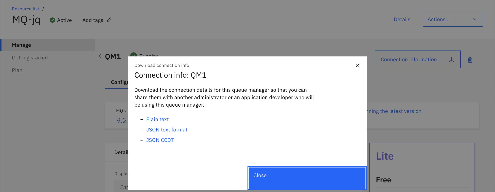
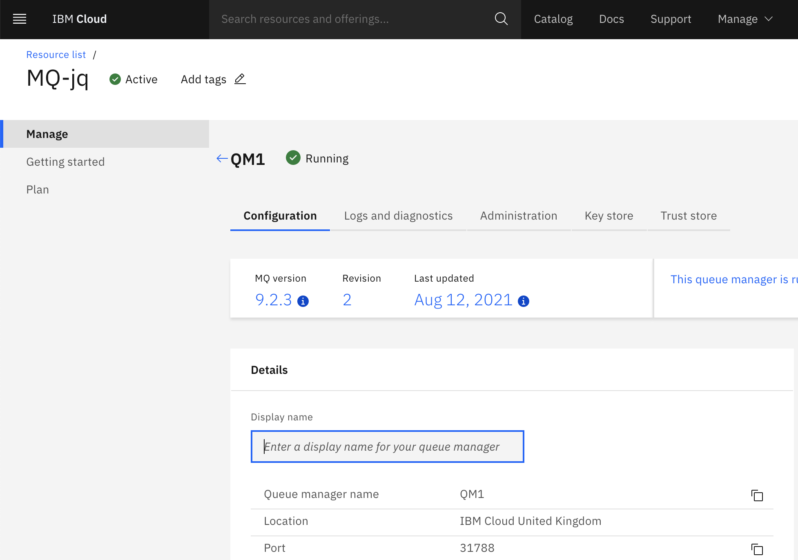
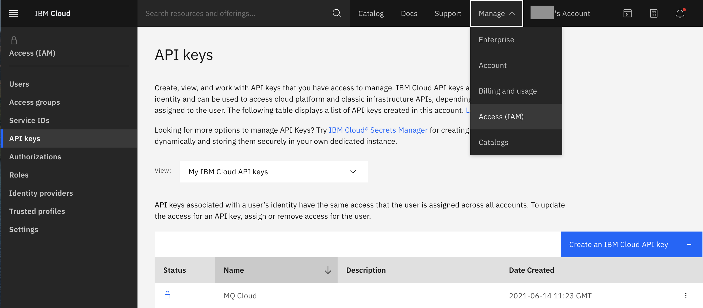
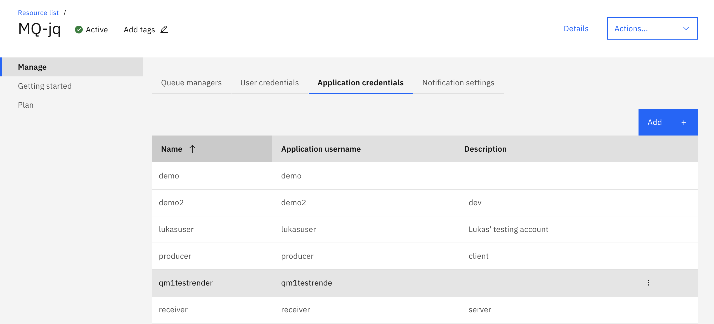

# Build and run simple MQ JMS app 


[🔗Detailed Version](https://github.com/ibm-messaging/mq-dev-patterns)


## Simplified Steps (Put/Get)


1.   Export path to `ccdt.json`

     ```shell
     export MQCCDTURL="file://${PWD}/ccdt.json"
     ```
     
1.   Build sample with Maven

     ```shell
     cd JMS
     mvn clean package
     ```

1.   Set up `ccdt.json` and `env.json` files appropriately. See below for details.

1.   Put messages to MQ

     ```shell
     java -cp target/mq-dev-patterns-0.1.0.jar: com.ibm.mq.samples.jms.JmsPut
     ```

1.   Get message from MQ

     ```shell
     java -cp target/mq-dev-patterns-0.1.0.jar: com.ibm.mq.samples.jms.JmsGet
     ```


## Help


#### How to set up `ccdt.json`?

1.   Download your Queue Manager connection info in JSON CCDT format.

     

1.   Rename this to `ccdt.json` and replace the existing one in current folder.


#### How to set up `env.json`?

1.   Host and Port: You can find your Queue Manager's Hostname and Port in "Configuration" page.

     

1.   Channel: You can find these inside your `ccdt.json` file.

1.   `APP_USER` and `APP_PASSWORD`: the username and API key of your IBM account.


#### Where can I find the `APP_USER` and `APP_PASSWORD` for `env.json`?

1.   User your personal IBM account username. And API key can be generated in: Manage -> Access(IAM) -> API Keys -> Create an IBM Cloud API Key

     

1.   Or you can use your application's name and API key: Manage-> Application credentials -> Add

     

